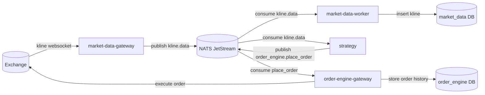

# High Frequency Trading Service

Event-driven trading platform for market data ingestion, strategy execution, and order execution.

## System Architecture

### Event flow
1. `market-data-gateway` consumes exchange kline data.
2. `market-data-gateway` publishes `kline.data` events.
3. `market-data-worker` consumes `kline.data` and stores records in `market_data` DB.
4. `strategy` consumes `kline.data` and decides: buy, sell, or no action.
5. If execution is required, `strategy` publishes `order_engine.place_order`.
6. `order-engine-gateway` consumes order events and executes to exchange.

### Diagram


## Services and Use Cases

### `market-data-gateway`
- Connects to exchange websocket stream.
- Normalizes incoming kline payload.
- Publishes `kline.data` to JetStream.

### `market-data-worker`
- Consumes `kline.data` events.
- Persists market kline records.
- Retries failed processing (bounded by config).

### `strategy`
- Consumes closed kline events.
- Runs strategy logic (buy/sell/hold).
- Publishes `order_engine.place_order` when execution is needed.

### `order-engine-gateway`
- Consumes place-order events.
- Converts order payload to exchange API format.
- Sends order and stores order history.

### `migrate`
- Runs DB migration for `market_data` and `order_engine`.

## Supported Exchanges
- Tokocrypto (currently supported).

## Quick Start (Local)

### 1) Prerequisites
- Go `1.25+`
- Docker + Docker Compose

### 2) Configure app
Copy config template:
```bash
copy config.yml.example config.yml
```

Update required values in `config.yml`:
- `exchanges.tokocrypto.api_key`
- `exchanges.tokocrypto.api_secret`
- `api_keys[*].key`

Host mapping reminder:
- Run app locally (`go run`): use `localhost` hosts.
- Run app in Docker: use compose service names (`postgresql`, `redis`, `nats`).

### 3) Start infrastructure
```bash
docker compose -f compose-dev.yaml up -d postgresql redis nats
```

### 4) Create databases
Run in PostgreSQL:
```sql
CREATE DATABASE market_data;
CREATE DATABASE order_engine;
```

### 5) Run migrations
```bash
go run . migrate --databaseName=market_data
go run . migrate --databaseName=order_engine
```

### 6) Seed `market_data`
```sql
INSERT INTO kline_subscriptions
(id, exchange, symbol, "interval", payload, created_at, updated_at)
VALUES
('2675c22f-d94b-4ede-bb27-5b6c375a1089', 'tokocrypto', 'TKO_IDR', '1m', '{"id": 1, "method": "SUBSCRIBE", "params": ["tkoidr@kline_1m"]}'::jsonb, '2026-02-22 13:46:45.903', '2026-02-22 13:46:45.903');

INSERT INTO symbol_mappings
(id, exchange, symbol, kline_symbol, order_symbol, created_at, updated_at)
VALUES
('4494faed-468c-46b5-b7ca-389419ad63ad', 'tokocrypto', 'TKOIDR', 'tkoidr', 'TKO_IDR', '2026-02-22 14:36:22.978', '2026-02-22 14:36:22.978');
```

### 7) Run services (separate terminals)
```bash
go run . market-data-gateway
```

```bash
go run . market-data-worker
```

```bash
go run . order-engine-gateway
```

```bash
go run . strategy
```

## Test Order API

### HTTP
```bash
curl --request POST \
  --url http://localhost:9801/order-engine/v1/orders \
  --header 'Content-Type: application/json' \
  --data '{
    "api_key": "REPLACE_WITH_SECURE_API_KEY_A",
    "request_id": "e1580b74-1af6-47e4-9b90-354875f1f19z",
    "user_id": "2cb989ec-5aea-422a-bb74-d735ae5d7230",
    "order_id": "1d421596-2ff1-4798-b1b5-5336ed39122z",
    "exchange": "tokocrypto",
    "symbol": "TKO_IDR",
    "type": "LIMIT",
    "side": "BUY",
    "price": "920",
    "quantity": "30",
    "source": "http-hit",
    "strategy_id": "d9b0ba9a-db44-4bb4-b862-a60d2e0299a6"
  }'
```

### gRPC payload example
```json
{
  "request_id": "e1580b74-1af6-47e4-9b90-354875f1f19e",
  "user_id": "2cb989ec-5aea-422a-bb74-d735ae5d7230",
  "order_id": "1d421596-2ff1-4798-b1b5-5336ed391227",
  "exchange": "tokocrypto",
  "symbol": "TKO_IDR",
  "type": "LIMIT",
  "side": "BUY",
  "price": "920",
  "quantity": "30",
  "source": "grpc-hit",
  "strategy_id": "d9b0ba9a-db44-4bb4-b862-a60d2e0299a6"
}
```

## TODO
- Sync order engine order history status.
- Build analytic service that consumes market data.
- Support HA deployment for all services.
- Support multiple user credentials.
- Support multiple exchanges.

## Contributing
Contributions are welcome and appreciated. I am open for contributions from the community.

If you want to contribute:
- Fork this repository.
- Create a feature/fix branch.
- Make focused changes with clear commit messages.
- Open a Pull Request with a short description of the problem and solution.
