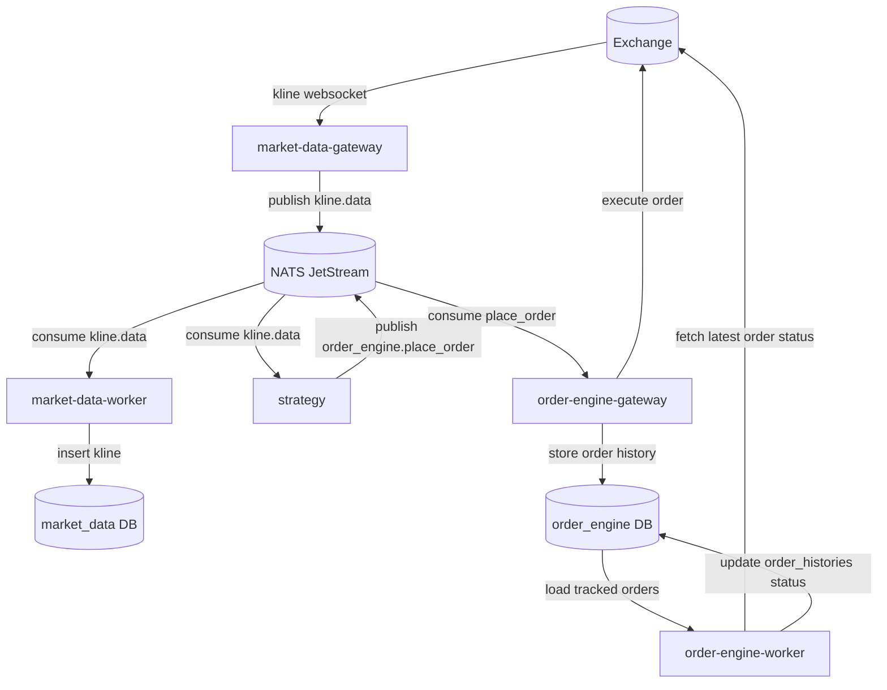

# High Frequency Trading Service

Event-driven trading platform for market data ingestion, strategy execution, and order execution.

## AI Assistance Notice
Most of the code in this repository was written with AI assistance.

## System Architecture

### Event flow
1. `market-data-gateway` consumes exchange kline data.
2. `market-data-gateway` publishes `kline.data` events.
3. `market-data-worker` consumes `kline.data` and stores records in `market_data` DB.
4. `strategy` consumes `kline.data` and decides: buy, sell, or no action.
5. If execution is required, `strategy` publishes `order_engine.place_order`.
6. `order-engine-gateway` consumes order events and executes to exchange.
7. `order-engine-gateway` stores initial order history in `order_engine` DB.
8. `order-engine-worker` polls tracked orders and fetches latest execution state from exchange.
9. `order-engine-worker` updates `order_histories` status in `order_engine` DB.

### Diagram

```mermaid
flowchart TB
  EX[(Exchange)]
  NATS[(NATS JetStream)]
  MDG[market-data-gateway]
  MDW[market-data-worker]
  STRAT[strategy]
  OEG[order-engine-gateway]
  OEW[order-engine-worker]
  MDB[(market_data DB)]
  ODB[(order_engine DB)]

  EX -->|kline websocket| MDG
  MDG -->|publish kline.data| NATS
  NATS -->|consume kline.data| MDW
  NATS -->|consume kline.data| STRAT
  MDW -->|insert kline| MDB
  STRAT -->|publish order_engine.place_order| NATS
  NATS -->|consume place_order| OEG
  OEG -->|execute order| EX
  OEG -->|store order history| ODB
  ODB -->|load tracked orders| OEW
  OEW -->|fetch latest order status| EX
  OEW -->|update order_histories status| ODB
```

## Services and Use Cases

### `market-data-gateway`
- Connects to exchange websocket stream.
- Normalizes incoming kline payload.
- Resolves exchange kline symbols into canonical internal symbols from `symbol_mappings.symbol`.
- For Binance, runs spot and futures websocket subscriptions in parallel by default.
- Publishes `kline.data` to JetStream.

### `market-data-worker`
- Consumes `kline.data` events.
- Persists market kline records using canonical internal symbol.
- Retries failed processing (bounded by config).

### `strategy`
- Consumes closed kline events.
- Runs strategy logic (buy/sell/hold).
- Publishes `order_engine.place_order` when execution is needed.

### `order-engine-gateway`
- Consumes place-order events.
- Converts canonical internal symbol to exchange order symbol using `symbol_mappings`.
- Routes Binance orders to spot/futures endpoint by `market_type`.
- Sends order and stores order history.

### `order-engine-worker`
- Syncs `order_histories` records with the latest execution state from exchange.
- Fetches latest order status from exchange for tracked orders.
- Updates local order history status to keep it consistent with exchange execution result.

### `migrate`
- Runs DB migration for `market_data` and `order_engine`.

## Supported Exchanges
- Tokocrypto
- Binance

## Market Type Support
- Supported values: `spot`, `futures`.
- `spot` is the default when `market_type` is omitted.
- Binance supports both spot and futures simultaneously by default.
- Tokocrypto currently uses `spot`.

## Quick Start (Local)

### 1) Prerequisites
- Go `1.25+`
- Docker + Docker Compose
- Node.js `20+` (for `web` Next.js app)

## Repository Layout

Core folders in this monorepo:
- `cmd/` Go CLI entrypoints for each service mode.
- `internal/` Business logic, repositories, handlers, and infrastructure.
- `migration/` SQL migration files for `market_data` and `order_engine`.
- `pb/` Generated protobuf files and proto definitions.
- `strategy/` Python-based strategy implementations.
- `web/` Next.js web application.

### 2) Configure app
Copy config template:
```bash
copy config.yml.example config.yml
```

Update required values in `config.yml`:
- `exchanges.binance.api_key`
- `exchanges.binance.api_secret`
- `exchanges.tokocrypto.api_key`
- `exchanges.tokocrypto.api_secret`
- `api_keys[*].key`

Host mapping reminder:
- Run app locally (`go run`): use `localhost` hosts.
- Run app in Docker: use compose service names (`postgresql`, `redis`, `nats`).

### 3) Start infrastructure
```bash
docker compose -f compose-dev.yaml up -d postgresql redis nats
```

### 4) Create databases
Run in PostgreSQL:
```sql
CREATE DATABASE market_data;
CREATE DATABASE order_engine;
```

### 5) Run migrations
```bash
go run . migrate --databaseName=market_data
go run . migrate --databaseName=order_engine
```

### 6) Seed `market_data`
Seed at least one subscription and symbol mapping per exchange you want to run.

Symbol rules:
- `symbol_mappings.symbol` is the canonical internal symbol used by the service.
- `kline_subscriptions.symbol` must use the same canonical internal symbol.
- `symbol_mappings.market_type` and `kline_subscriptions.market_type` must match (`spot` or `futures`).
- Subscription `payload` is regenerated by the gateway from mapping (`kline_symbol`) and interval.

#### Binance example (BTCUSDT, 1m)
```sql
INSERT INTO kline_subscriptions
(id, exchange, market_type, symbol, "interval", payload, created_at, updated_at)
VALUES
('3f040de8-c018-4f74-9ad8-7bcfe6f11db1', 'binance', 'spot', 'BTC_USDT', '1m', '{"method": "SUBSCRIBE", "params": ["btcusdt@kline_1m"], "id": 1}'::jsonb, NOW(), NOW()),
('2f7690af-bebf-4c66-aec3-7ea4c4feccbf', 'binance', 'futures', 'BTC_USDT', '1m', '{"method": "SUBSCRIBE", "params": ["btcusdt@kline_1m"], "id": 1}'::jsonb, NOW(), NOW());

INSERT INTO symbol_mappings
(id, exchange, market_type, symbol, kline_symbol, order_symbol, created_at, updated_at)
VALUES
('f2e7bca4-d3f7-4b5f-a74f-5273f36ea565', 'binance', 'spot', 'BTC_USDT', 'btcusdt', 'BTCUSDT', NOW(), NOW()),
('a9f00eab-9b1f-4b18-858f-4e5aa12f741c', 'binance', 'futures', 'BTC_USDT', 'btcusdt', 'BTCUSDT', NOW(), NOW());
```

#### Tokocrypto example (TKOIDR, 1m)
```sql
INSERT INTO kline_subscriptions
(id, exchange, market_type, symbol, "interval", payload, created_at, updated_at)
VALUES
('2675c22f-d94b-4ede-bb27-5b6c375a1089', 'tokocrypto', 'spot', 'TKO_IDR', '1m', '{"id": 1, "method": "SUBSCRIBE", "params": ["tkoidr@kline_1m"]}'::jsonb, '2026-02-22 13:46:45.903', '2026-02-22 13:46:45.903');

INSERT INTO symbol_mappings
(id, exchange, market_type, symbol, kline_symbol, order_symbol, created_at, updated_at)
VALUES
('4494faed-468c-46b5-b7ca-389419ad63ad', 'tokocrypto', 'spot', 'TKO_IDR', 'tkoidr', 'TKO_IDR', '2026-02-22 14:36:22.978', '2026-02-22 14:36:22.978');
```

### 7) Run services (separate terminals)
```bash
go run . market-data-gateway
```

```bash
go run . market-data-worker
```

```bash
go run . order-engine-gateway
```

```bash
go run . order-engine-worker
```

```bash
go run . strategy
```

## Web App (Next.js)

The web app lives in `web/` and is managed independently from the Go modules.

Install dependencies:
```bash
cd web
npm install
```

Run in development mode:
```bash
cd web
npm run dev
```

Build for production:
```bash
cd web
npm run build
npm run start
```

## Test Order API

### HTTP
```bash
curl --request POST \
  --url http://localhost:9801/order-engine/v1/orders \
  --header 'Content-Type: application/json' \
  --data '{
    "api_key": "REPLACE_WITH_SECURE_API_KEY_A",
    "request_id": "e1580b74-1af6-47e4-9b90-354875f1f19z",
    "user_id": "2cb989ec-5aea-422a-bb74-d735ae5d7230",
    "order_id": "1d421596-2ff1-4798-b1b5-5336ed39122z",
    "exchange": "tokocrypto",
    "market_type": "spot",
    "symbol": "TKO_IDR",
    "type": "LIMIT",
    "side": "BUY",
    "price": "920",
    "quantity": "30",
    "source": "http-hit",
    "strategy_id": "d9b0ba9a-db44-4bb4-b862-a60d2e0299a6",
    "is_paper_trading": true
  }'
```

### gRPC payload example
```json
{
  "request_id": "e1580b74-1af6-47e4-9b90-354875f1f19e",
  "user_id": "2cb989ec-5aea-422a-bb74-d735ae5d7230",
  "order_id": "1d421596-2ff1-4798-b1b5-5336ed391227",
  "exchange": "tokocrypto",
  "market_type": "spot",
  "symbol": "TKO_IDR",
  "type": "LIMIT",
  "side": "BUY",
  "price": "920",
  "quantity": "30",
  "source": "grpc-hit",
  "strategy_id": "d9b0ba9a-db44-4bb4-b862-a60d2e0299a6",
  "is_paper_trading": true
}
```

### Market Data gRPC backfill payload example
```json
{
  "end_time": "1775725027000",
  "exchange": "tokocrypto",
  "interval": "15m",
  "market_type": "spot",
  "start_time": "1773046627000",
  "symbol": "TKO_IDR"
}
```

## TODO
- Build analytic service that consumes market data.
- Support HA deployment for all services.
- Support multiple user credentials.
- Support multiple exchanges.

## Contributing
Contributions are welcome and appreciated. I am open for contributions from the community.

If you want to contribute:
- Fork this repository.
- Create a feature/fix branch.
- Make focused changes with clear commit messages.
- Open a Pull Request with a short description of the problem and solution.
