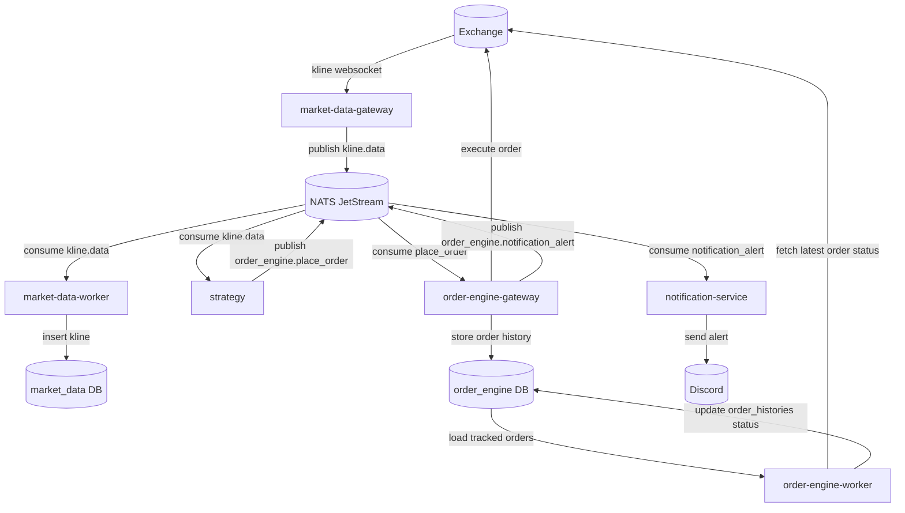

# High Frequency Trading Service

Event-driven trading platform for market data ingestion, strategy execution, and order execution.

## Why This Project Exists

This repository is built to run automated crypto trading workflows in a modular, production-oriented architecture:

- ingest real-time exchange kline streams,
- execute strategy signals,
- place and track orders,
- and send operational alerts.

Most of the code in this repository was written with AI assistance.

## Table of Contents

- [How HFT Works in This Repository](#how-hft-works-in-this-repository)
- [System Architecture](#system-architecture)
- [Services and Use Cases](#services-and-use-cases)
- [API Service Documentation](docs/API_SERVICE.md)
- [Supported Exchanges](#supported-exchanges)
- [Market Type Support](#market-type-support)
- [Quick Start (Local)](#quick-start-local)
- [How to Run Strategy](#how-to-run-strategy)
- [Profit Results](#profit-results)
- [Test Order API](#test-order-api)
- [Roadmap](#roadmap)
- [Support This Project](#support-this-project)
- [Contributing](#contributing)

## How HFT Works in This Repository

This project follows an event-driven HFT loop:

1. Market data gateway subscribes to exchange websocket kline streams.
2. Incoming candles are normalized and published to NATS JetStream (`kline.data`).
3. Worker persists market data into the `market_data` database.
4. Strategy consumes closed candles and decides buy/sell/hold.
5. If action is needed, strategy publishes `order_engine.place_order`.
6. Order engine gateway executes the order to the exchange.
7. Order engine worker continuously reconciles order status until terminal state.
8. Notification service emits Discord alerts for important events.

In short: low-latency event ingestion + deterministic signal execution + robust post-trade reconciliation.

## System Architecture

### Event Flow

1. `market-data-gateway` consumes exchange kline data.
2. `market-data-gateway` publishes `kline.data` events.
3. `market-data-worker` consumes `kline.data` and stores records in `market_data` DB.
4. `strategy` consumes `kline.data` and decides: buy, sell, or no action.
5. If execution is required, `strategy` publishes `order_engine.place_order`.
6. `order-engine-gateway` consumes order events and executes to exchange.
7. `order-engine-gateway` stores initial order history in `order_engine` DB.
8. `order-engine-worker` polls tracked orders and fetches latest execution state from exchange.
9. `order-engine-worker` updates `order_histories` status in `order_engine` DB.
10. `notification-service` consumes notification events and sends Discord alerts.

### Diagram


```mermaid
flowchart TB
  EX[(Exchange)]
  NATS[(NATS JetStream)]
  MDG[market-data-gateway]
  MDW[market-data-worker]
  STRAT[strategy]
  OEG[order-engine-gateway]
  OEW[order-engine-worker]
  NS[notification-service]
  MDB[(market_data DB)]
  ODB[(order_engine DB)]
  DISCORD[(Discord)]

  EX -->|kline websocket| MDG
  MDG -->|publish kline.data| NATS
  NATS -->|consume kline.data| MDW
  NATS -->|consume kline.data| STRAT
  MDW -->|insert kline| MDB
  STRAT -->|publish order_engine.place_order| NATS
  NATS -->|consume place_order| OEG
  OEG -->|execute order| EX
  OEG -->|store order history| ODB
  OEG -->|publish order_engine.notification_alert| NATS
  NATS -->|consume notification_alert| NS
  NS -->|send alert| DISCORD
  ODB -->|load tracked orders| OEW
  OEW -->|fetch latest order status| EX
  OEW -->|update order_histories status| ODB
```

## Services and Use Cases

### `market-data-gateway`

- Connects to exchange websocket stream.
- Normalizes incoming kline payload.
- Resolves exchange kline symbols into canonical internal symbols from `symbol_mappings.symbol`.
- For Binance, runs spot and futures websocket subscriptions in parallel by default.
- Publishes `kline.data` to JetStream.

### `market-data-worker`

- Consumes `kline.data` events.
- Persists market kline records using canonical internal symbol.
- Retries failed processing (bounded by config).

### `strategy`

- Consumes closed kline events.
- Runs strategy logic (buy/sell/hold).
- Publishes `order_engine.place_order` when execution is needed.

### `order-engine-gateway`

- Consumes place-order events.
- Converts canonical internal symbol to exchange order symbol using `symbol_mappings`.
- Routes Binance orders to spot/futures endpoint by `market_type`.
- Sends order and stores order history.

### `order-engine-worker`

- Syncs `order_histories` records with the latest execution state from exchange.
- Fetches latest order status from exchange for tracked orders.
- Updates local order history status to keep it consistent with exchange execution result.

### `notification-service`

- Consumes `order_engine.notification_alert` events from JetStream.
- Sends Discord alert messages for orders with `need_notification = true`.
- Alert payload is general (no quantity), containing strategy name, symbol, internal symbol, interval, side, and price.

### `api`

- Provides the centralized dashboard HTTP API.
- Handles dashboard authentication, refresh tokens, and RBAC.
- Exposes read APIs for orders and market data.
- Exposes CRUD APIs for symbol mappings, kline subscriptions, strategy configs, and dashboard settings.
- Full endpoint documentation: [docs/API_SERVICE.md](docs/API_SERVICE.md).

### `migrate`

- Runs DB migration for `api`, `market_data`, and `order_engine`.

## Supported Exchanges

- Tokocrypto
- Binance

## Market Type Support

- Supported values: `spot`, `futures`.
- `spot` is the default when `market_type` is omitted.
- Binance supports both spot and futures simultaneously by default.
- Tokocrypto currently uses `spot`.

## Quick Start (Local)

### 1) Prerequisites

- Go `1.25+`
- Docker + Docker Compose

### 2) Configure app

Copy config template:

```bash
copy config.yml.example config.yml
```

Update required values in `config.yml`:

- `exchanges.binance.api_key`
- `exchanges.binance.api_secret`
- `exchanges.tokocrypto.api_key`
- `exchanges.tokocrypto.api_secret`
- `api_keys[*].key`
- `notification.discord_webhook_url` (required when running `notification-service`)

If you run multiple users/API keys, configure per-user exchange accounts (recommended):

```yaml
exchanges:
  binance:
    api_key: "default-key-optional"
    api_secret: "default-secret-optional"
    accounts:
      paper-1:
        api_key: "binance-key-user-1"
        api_secret: "binance-secret-user-1"
      minimax-01:
        api_key: "binance-key-user-2"
        api_secret: "binance-secret-user-2"
  tokocrypto:
    api_key: "default-key-optional"
    api_secret: "default-secret-optional"
    accounts:
      paper-1:
        api_key: "tokocrypto-key-user-1"
        api_secret: "tokocrypto-secret-user-1"
```

Credential resolution behavior:

- Order engine resolves exchange credentials by `user_id` first from `exchanges.<exchange>.accounts.<user_id>`.
- If no account match is found, it falls back to `exchanges.<exchange>.api_key/api_secret`.

Host mapping reminder:

- Run app locally (`go run`): use `localhost` hosts.
- Run app in Docker: use compose service names (`postgresql`, `redis`, `nats`).

### 3) Start infrastructure

```bash
docker compose -f compose-dev.yaml up -d postgresql redis nats
```

### 4) Create databases

Run in PostgreSQL:

```sql
CREATE DATABASE market_data;
CREATE DATABASE order_engine;
```

### 5) Run migrations

```bash
go run . migrate --databaseName=market_data
go run . migrate --databaseName=order_engine
```

### 6) Seed `market_data`

Seed at least one subscription and symbol mapping per exchange you want to run.

Symbol rules:

- `symbol_mappings.symbol` is the canonical internal symbol used by the service.
- `kline_subscriptions.symbol` must use the same canonical internal symbol.
- `symbol_mappings.market_type` and `kline_subscriptions.market_type` must match (`spot` or `futures`).
- Subscription `payload` is regenerated by the gateway from mapping (`kline_symbol`) and interval.

#### Binance example (BTCUSDT, 1m)

```sql
INSERT INTO kline_subscriptions
(id, exchange, market_type, symbol, "interval", payload, created_at, updated_at)
VALUES
('3f040de8-c018-4f74-9ad8-7bcfe6f11db1', 'binance', 'spot', 'BTC_USDT', '1m', '{"method": "SUBSCRIBE", "params": ["btcusdt@kline_1m"], "id": 1}'::jsonb, NOW(), NOW()),
('2f7690af-bebf-4c66-aec3-7ea4c4feccbf', 'binance', 'futures', 'BTC_USDT', '1m', '{"method": "SUBSCRIBE", "params": ["btcusdt@kline_1m"], "id": 1}'::jsonb, NOW(), NOW());

INSERT INTO symbol_mappings
(id, exchange, market_type, symbol, kline_symbol, order_symbol, created_at, updated_at)
VALUES
('f2e7bca4-d3f7-4b5f-a74f-5273f36ea565', 'binance', 'spot', 'BTC_USDT', 'btcusdt', 'BTCUSDT', NOW(), NOW()),
('a9f00eab-9b1f-4b18-858f-4e5aa12f741c', 'binance', 'futures', 'BTC_USDT', 'btcusdt', 'BTCUSDT', NOW(), NOW());
```

#### Tokocrypto example (TKOIDR, 1m)

```sql
INSERT INTO kline_subscriptions
(id, exchange, market_type, symbol, "interval", payload, created_at, updated_at)
VALUES
('2675c22f-d94b-4ede-bb27-5b6c375a1089', 'tokocrypto', 'spot', 'TKO_IDR', '1m', '{"id": 1, "method": "SUBSCRIBE", "params": ["tkoidr@kline_1m"]}'::jsonb, '2026-02-22 13:46:45.903', '2026-02-22 13:46:45.903');

INSERT INTO symbol_mappings
(id, exchange, market_type, symbol, kline_symbol, order_symbol, created_at, updated_at)
VALUES
('4494faed-468c-46b5-b7ca-389419ad63ad', 'tokocrypto', 'spot', 'TKO_IDR', 'tkoidr', 'TKO_IDR', '2026-02-22 14:36:22.978', '2026-02-22 14:36:22.978');
```

### 7) Seed `strategy_configs` (required)

`user_id` and risk controls are now sourced per pair from this table. Strategy runtime no longer reads `user_id` and shared risk controls from `strategy/config.yml`.

Example:

```sql
INSERT INTO strategy_configs
(id, strategy, exchange, market_type, symbol, interval, user_id, need_notification, is_paper_trading, order_type, order_qty, limit_slippage_pct,
 cooldown_bars, sl_cooldown_bars, max_consecutive_stop_losses, sl_pause_bars, take_profit_pct, stop_loss_pct, trailing_stop_pct, trailing_stop_trigger_pct, max_hold_bars, max_positions, enable_intrabar_risk_exit,
 created_at, updated_at)
VALUES
('7f5f6d39-fd5b-4c94-b9f4-41c9b92e2c01', 'python-krobot01-ema200-vwap-macd', 'tokocrypto', 'spot', 'TKO_IDR', '1m', 'paper-1', true, true, 'LIMIT', 10, 0.02,
 2, 3, 2, 10, 0.25, 0.15, 0.12, 0.20, 24, 1, true,
 NOW(), NOW()),
('f0e8d75f-77de-448b-9eb3-9948e3a0d742', 'python-krobot02-vwap-volume', 'tokocrypto', 'spot', 'TKO_IDR', '1m', 'paper-02', true, true, 'LIMIT', 10, 0.02,
 2, 3, 2, 10, 0.25, 0.15, 0.12, 0.20, 24, 1, true,
 NOW(), NOW()),
('96c50cef-07ea-42e2-b4f7-bf9f12c11a82', 'python-ai-minimax-m2-7-hybrid', 'binance', 'futures', 'BTC_USDT', '1m', 'minimax-01', true, false, 'MARKET', 10, 0.02,
 2, 3, 2, 10, 0.25, 0.15, 0.12, 0.20, 24, 1, true,
 NOW(), NOW());
```

Important rules:

- `strategy` must match your strategy runtime `strategy_id`.
- `exchange/market_type/symbol/interval` must match active kline subscription + symbol mapping.
- `user_id` must match your exchange account key path, for example `exchanges.binance.accounts.minimax-01`.

### 8) Configure strategy runtime (`strategy/config.yml`)

Copy and update strategy config:

```bash
copy strategy\config.yml.example strategy\config.yml
```

Minimum required settings in `strategy/config.yml`:

- `global.nats_url`
- `global.strategy_api_base_url`
- `global.strategy_api_key`
- `<strategy>.source`
- `<strategy>.strategy_id`
- `<strategy>.order_subject`
- `<strategy>.order_type`
- `<strategy>.order_qty`

Notes:

- Do not set `user_id` in strategy config anymore.
- Strategy user routing is now pair-based from `strategy_configs.user_id`.
- Pair-level risk controls are now sourced from `strategy_configs` columns.

### 9) Run services (separate terminals)

```bash
go run . market-data-gateway
```

```bash
go run . market-data-worker
```

```bash
go run . order-engine-gateway
```

```bash
go run . order-engine-worker
```

```bash
go run . notification-service
```

```bash
make build-strategy
make run-strategy
```

## How to Run Strategy

There are two common ways to run strategy in this repository.

### Option A: Run via Makefile (recommended)

This is the main runtime strategy flow used by this repository.

1. Start infrastructure and required services first:
  - `market-data-gateway`
  - `market-data-worker`
  - `order-engine-gateway`
  - `order-engine-worker`
2. Build strategy runner image:

```bash
make build-strategy
```

3. Run strategy:

```bash
make run-strategy
```

4. Verify the container is running:

```bash
docker ps --filter "name=-runner"
```

5. Verify logs show strategy consuming closed kline events and publishing `order_engine.place_order` when signals fire.

```bash
docker logs -f krobot01-runner
```

### Option B: Run a specific Python strategy file

For Python-based strategy scripts under `strategy/`:

```bash
make run-strategy STRATEGY_FILE=krobot01
```

Supertrend example:

```bash
make run-strategy STRATEGY_FILE=supertrend
```

This uses Docker image `python-strategy` and mounts local `strategy/` into `/app`.

### Configuration Checklist

- Ensure strategy symbols match canonical internal symbol mapping (`symbol_mappings.symbol`).
- Ensure `market_type` alignment (`spot` or `futures`) across subscriptions and mappings.
- Ensure every active `strategy_configs` row has non-empty `user_id`.
- Ensure each `strategy_configs.user_id` maps to configured exchange credentials.
- Set required API keys and NATS/database hosts in `config.yml`.
- For Python strategy tuning, update risk control values in `strategy_configs` row columns.

## Profit Results

All strategies below were run with approximately $30 margin and 20x leverage.

Performance snapshot:

- Runtime window: 2026-05-31 00:30:00 to 2026-06-01 14:47:59 (38h 17m 59s)
- Gross profit: $56.673
- Gross loss: $32.424
- Net PnL: +$24.249

| strategy_id   | symbol      | start_trade_date    | end_trade_date      |   total_profit |   win_rate |    avg_size |   total_trades |   winning_trades |   losing_trades |
|:--------------|:------------|:--------------------|:--------------------|---------------:|-----------:|------------:|---------------:|-----------------:|----------------:|
| krobot01      | BNB_USDT.P  | 2026-05-31 00:30:00 | 2026-06-01 13:44:02 |          9.647 |   0.545455 |    0.841545 |             11 |                8 |               3 |
| krobot02      | TRX_USDT.P  | 2026-05-31 15:30:02 | 2026-06-01 07:15:04 |          8.492 |   1        | 1722.68     |              2 |                2 |               0 |
| krobot02      | HYPE_USDT.P | 2026-05-31 07:00:04 | 2026-06-01 14:15:00 |          8.031 |   0.692308 |    8.57495  |             13 |                9 |               4 |
| krobot02      | ETH_USDT.P  | 2026-05-31 04:30:00 | 2026-06-01 14:15:00 |          7.112 |   0.6      |    0.298091 |             10 |                6 |               4 |
| krobot01      | TRX_USDT.P  | 2026-05-31 00:45:00 | 2026-06-01 07:09:16 |          6.456 |   0.666667 | 1721.7      |              3 |                2 |               1 |
| ai            | ETH_USDT.P  | 2026-05-31 03:00:34 | 2026-06-01 14:47:59 |          5.596 |   0.714286 |    0.29854  |              7 |                5 |               2 |
| krobot01      | SOL_USDT.P  | 2026-05-31 00:30:00 | 2026-06-01 13:49:45 |          5     |   0.545455 |    7.27711  |             11 |                6 |               5 |
| ai            | HYPE_USDT.P | 2026-05-31 11:31:05 | 2026-06-01 03:12:34 |          3.113 |   0.666667 |    8.67509  |              3 |                2 |               1 |
| krobot01      | ETH_USDT.P  | 2026-05-31 04:30:00 | 2026-06-01 14:05:09 |          2.173 |   0.444444 |    0.298796 |              9 |                4 |               5 |
| ai            | SOL_USDT.P  | 2026-05-31 13:01:13 | 2026-06-01 12:27:27 |          1.025 |   0.5      |    7.28626  |              6 |                3 |               3 |
| ai            | BNB_USDT.P  | 2026-05-31 23:15:41 | 2026-06-01 05:55:50 |          0.028 |   0.5      |    0.836655 |              2 |                1 |               1 |
| ai            | TRX_USDT.P  | 2026-05-31 12:32:02 | 2026-06-01 02:16:23 |         -0.072 |   0.333333 | 1722.99     |              3 |                1 |               2 |
| krobot01      | HYPE_USDT.P | 2026-05-31 02:30:00 | 2026-06-01 00:34:26 |         -0.847 |   0.428571 |    8.75397  |              7 |                3 |               4 |
| krobot02      | SOL_USDT.P  | 2026-05-31 04:15:00 | 2026-06-01 14:00:04 |        -11.927 |   0.181818 |    7.27353  |             11 |                2 |               9 |
| krobot02      | BNB_USDT.P  | 2026-05-31 01:00:00 | 2026-06-01 14:00:04 |        -19.578 |   0.181818 |    0.832617 |             11 |                2 |               9 |

Final result: this service generated a net profit of approximately +$24.249 in about 38.3 hours.

## Test Order API

### HTTP

```bash
curl --request POST \
  --url http://localhost:9801/order-engine/v1/orders \
  --header 'Content-Type: application/json' \
  --data '{
    "api_key": "REPLACE_WITH_SECURE_API_KEY_A",
    "request_id": "e1580b74-1af6-47e4-9b90-354875f1f19z",
    "user_id": "2cb989ec-5aea-422a-bb74-d735ae5d7230",
    "order_id": "1d421596-2ff1-4798-b1b5-5336ed39122z",
    "exchange": "tokocrypto",
    "market_type": "spot",
    "symbol": "TKO_IDR",
    "type": "LIMIT",
    "side": "BUY",
    "price": "920",
    "quantity": "30",
    "source": "http-hit",
    "strategy_id": "d9b0ba9a-db44-4bb4-b862-a60d2e0299a6",
    "strategy_name": "TREND_FOLLOWING_ATR",
    "interval": "15m",
    "internal": "SOL_USDT.P",
    "need_notification": true,
    "is_paper_trading": true
  }'
```

### gRPC Payload Example

```json
{
  "request_id": "e1580b74-1af6-47e4-9b90-354875f1f19e",
  "user_id": "2cb989ec-5aea-422a-bb74-d735ae5d7230",
  "order_id": "1d421596-2ff1-4798-b1b5-5336ed391227",
  "exchange": "tokocrypto",
  "market_type": "spot",
  "symbol": "TKO_IDR",
  "type": "LIMIT",
  "side": "BUY",
  "price": "920",
  "quantity": "30",
  "source": "grpc-hit",
  "strategy_id": "d9b0ba9a-db44-4bb4-b862-a60d2e0299a6",
  "is_paper_trading": true
}
```

### Market Data gRPC Backfill Payload Example

```json
{
  "end_time": "1775725027000",
  "exchange": "tokocrypto",
  "interval": "15m",
  "market_type": "spot",
  "start_time": "1773046627000",
  "symbol": "TKO_IDR"
}
```

## Roadmap

- Build analytic service that consumes market data.
- Support HA deployment for all services.
- Improve multi-user credential management UX (dashboard/admin APIs).
- Support multiple exchanges.
- Dashboard

## Support This Project

If this project helps you, please consider donating to support development and infrastructure costs.

- USDT (TRC20, TRON): `TWqgxX7SZHCnCsx4VJNWtJUgmmiwk78W6S`
- SOL (Solana Network): `BisxMDwGpFUmSJzUtHjHhDjzSxdJQ3Luc3TPVD98hypj`

Every donation helps maintain this project and accelerate new features.

## Contributing

Contributions are very welcome. If you want to improve this project, you are invited to open a PR.

### How to Contribute

1. Fork this repository.
2. Create a feature/fix branch.
3. Make focused changes with clear commit messages.
4. Run tests/checks for your changes.
5. Open a Pull Request with a short description of problem and solution.

### Contribution Ideas

- New exchange connectors.
- Better risk management controls.
- Performance profiling and latency optimization.
- Improved strategy evaluation and reporting.
